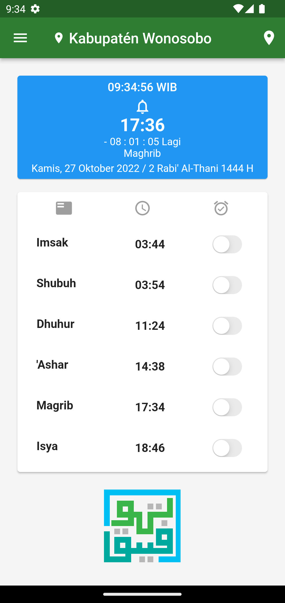
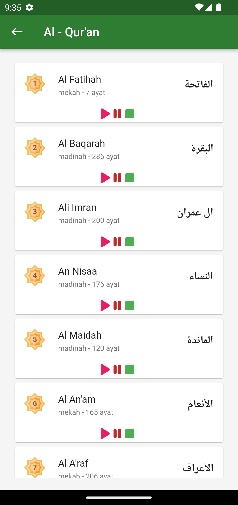
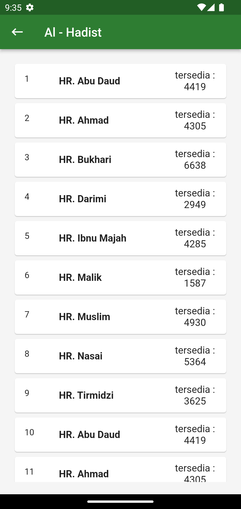
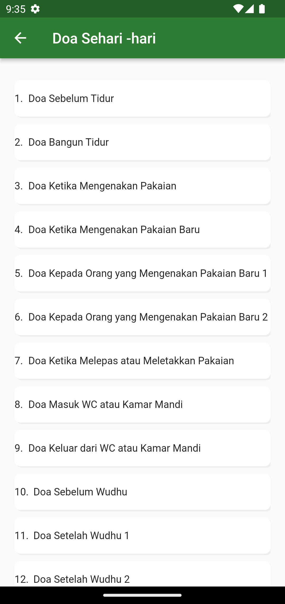
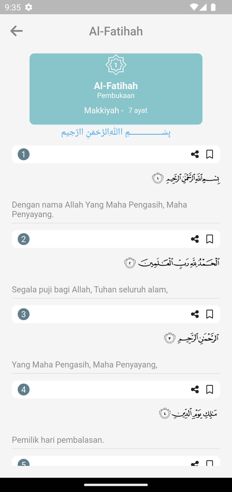
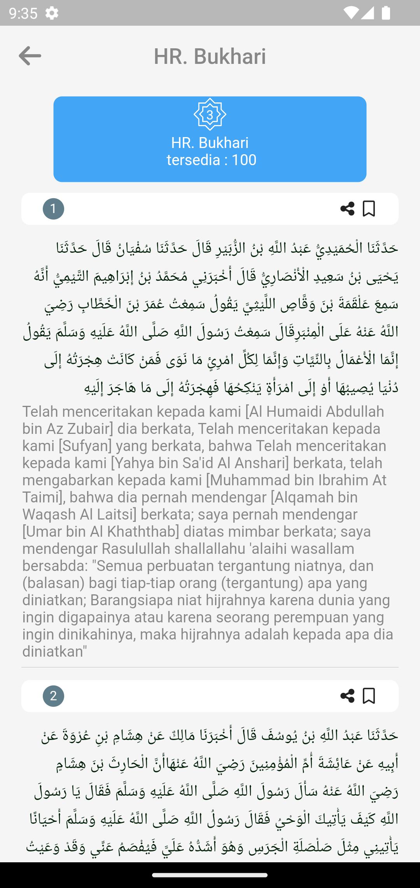
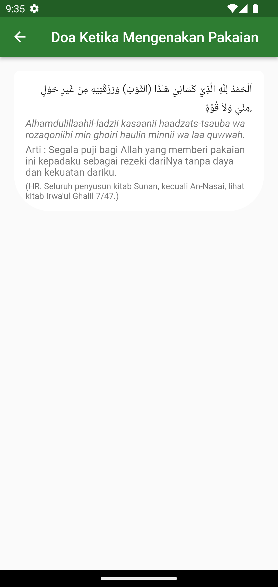

## Ngibadah App

Aplikasi Waktu Sholat berdasarkan Geolocation
terdapat juga fitur :

- Al Qur'an & Terjemah
- Hadis Shahih dan Terjemah
- Doa Sehari - hari

# Screenshoot
| Home      | Qur'an Page     | Hadis Page | Doa Page | 
|-----------|-----------|--------|--------|
|  |  |  |  |

#
| Qur'an Detail | Hadis Detail | Doa Detail | 
|-----------|--------|--------|
|  |  |  |

